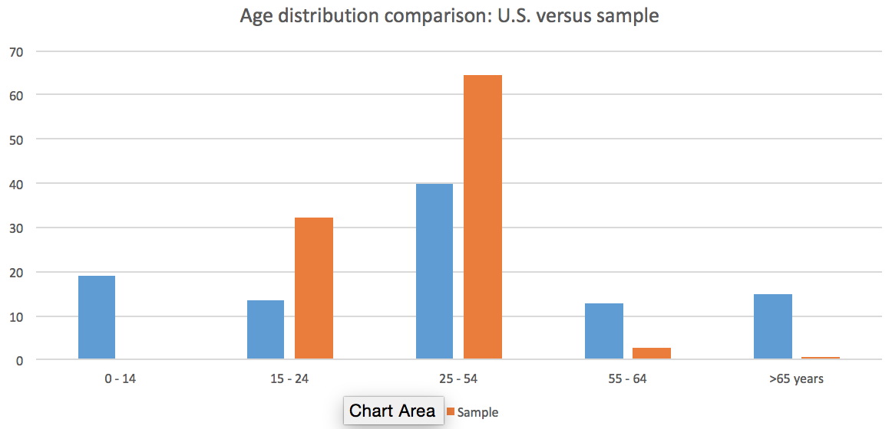

```{r global_options, include=FALSE}
knitr::opts_chunk$set(fig.width=4, fig.height=3.5, fig.path='Figs/',
                      echo=FALSE, warning=FALSE, message=FALSE)
options(scipen=1, digits=2)
```

### Question 1

### Question 2: The Radio Survey Dataset

#### 2.a.1 Import and clean the data

Read the data into R, and extract only the variables of interest: "worktime", "age", "edu", "gender", "income", "sirius", "wharton".

```{r, import, echo = F}
## Clear the R environment, and import necessary packages. 
library(plyr)
library(ggplot2)
library(sqldf)

survey_raw <- read.csv("Survey_results_final.csv")
# Extract only the necessary variables
cols_keep <- c("WorkTimeInSeconds", "Answer.Age", "Answer.Education", "Answer.Gender", "Answer.HouseHoldIncome", "Answer.Sirius.Radio", "Answer.Wharton.Radio")
survey <- survey_raw[cols_keep]
colnames(survey) <- c("worktime", "age", "edu", "gender", "income", "sirius", "wharton")
```

- Survey responses to question on gender. 

```{r cleaning1}
# view gender variable
print(levels(survey$gender))
survey <- survey[-c(which(survey$gender == "")),]
```

- Survey responses to question on age.

```{r cleaning2}
# view age variable
print(levels(survey$age))
```

- Survey responses to question on education.
```{r cleaning3}
#view education variable
print(unique(survey$edu))
```

To clean the data, we did the following:

* Remove data points with gender ""

* Remove data points with age = "", "female"

* Replace mistyped age = "223", "4", "Eighteen (18)", "27`"

* Remove data points with education = "select one"

```{r cleaning4}
# removing participant data with missing values.
survey <- survey[-which(survey$age == ""),]
survey <- survey[-which(survey$age == "female"),]
survey$age[which(survey$age == "223")] <- "23"
survey$age[which(survey$age == "27`")] <- "27"
survey$age[which(survey$age == "4")] <- "40"  # not sure if should delete this data point
survey$age[which(survey$age == "Eighteen (18)")] <- "18"
survey$age <- as.numeric(levels(survey$age))[survey$age]
survey <- survey[-which(survey$edu == "select one"),]
```

#### 2.a.2 summarize all the variables collected 

**Gender **

58% of the sample are male, and 42% of the sample are female.

```{r summarize_gender, fig.height = 3, fig.width=3}
# plot pie chart indicating male-female ratio
a <- summary(survey$gender)[2:3]
gender <- c("female", "male")
number <- c(a[1]/(a[1] + a[2]),a[2]/(a[1] + a[2]))
gender <- data.frame(gender, number)

p <- ggplot(gender, aes(x = 1, y = number, fill = gender)) + 
  geom_bar(stat="identity") +
  coord_polar(theta = 'y')
p <- p + 
  geom_bar(stat = "identity", color = 'black') +
  guides(fill=guide_legend(override.aes=list(colour=NA))) +
  theme(axis.ticks=element_blank(),  # the axis ticks
          axis.title=element_blank(),  # the axis labels
          axis.text.y=element_blank()) # the 0.75, 1.00, 1.25 labels.
print(p)
```

**Work time **

Variable "work time" inicates the number of minutes participants spent completing the questionnaire. 

__Summary of work time:__

```{r summarize_worktime}
# summarize worktime variable
summary(survey$worktime)
```

Participants on average spent 21 minutes completing the questionnaire. The fastest participant only used 8 minutes, and the slowliest used 108 minutes. 

The distribution of work time is as follows:

```{r summarize_worktime2, fig.height = 3, fig.width=3}
#plot the distribution of worktime variable
f1 <- ggplot(survey, aes(worktime)) + 
  geom_histogram(bins = 60) +
  xlab("Work Time (s)") + ylab("Count") + 
  ggtitle("Distribution of work time")
f1
```

**Age **

__summary of age:__
```{r summarize_age}
# summarize age
a <- summary(survey$age)
print(a)
b <- sd(survey$age)
```

Sample data suggest that the porportion of young people filling out our survey is significant larger than older people. 59.4% of our sample is between 18 and 30 years old. The mean age of our sample is `r a[4]` with a standard deviation of `r b`. 

The distribution of age is as follows:

```{r summarize_age2, fig.height = 3, fig.width=3}
# plot the distribution of variable age
f2 <- ggplot(survey, aes(age)) + 
  geom_histogram(bins = 30) +
  xlab("Age") + ylab("Count") + 
  ggtitle("Distribution of participant age")
f2
```

**Education **

Most of participants (~77%) reported receiving either "Some college, no diploma; or associate's degree", or Bachelor's degree. Male and female participants demonstrate similar distribution of education. 

```{r summarize_education}
# revalue the factor variable "education"
survey$edu <- revalue(survey$edu, c("Less than 12 years; no high school diploma" = "<12",
                                    "High school graduate (or equivalent)" = "High school",
                                    "Some college, no diploma; or Associate’s degree" = "Some college",
                                    "Bachelor’s degree or other 4-year degree" = "Bachelor", 
                                    "Graduate or professional degree" = "Graduate",
                                    "Other" = "Other",
                                    "select one" = "select one"   
                      ))
summary_edu <- summary(survey$edu)
f <- ggplot(survey, aes(x = edu, fill = gender)) + geom_bar(position = "dodge") + ggtitle("Distribution of participant education by gender")
```

__Number (and %) of participants in education levels__

< 12 years    |   High School  |  Some College  |   Bachelor     |   Graduate     | Other 
------------- | -------------  | -------------- | -------------  | -------------  | ------------- 
`r summary_edu[4]` (`r summary_edu[4]/17.38`%)  | `r summary_edu[3]` (`r summary_edu[3]/17.38`%)| `r summary_edu[1]` (`r summary_edu[1]/17.38`%) | `r summary_edu[7]` (`r summary_edu[7]/17.38`%) | `r summary_edu[2]` (`r summary_edu[2]/17.38`%) | `r summary_edu[5]` (`r summary_edu[5]/17.38`%) 

```{r summarize_education2, fig.height=3, fig.width= 5}
print(f)
```

**Income **

85% of participant's income fall in range $15,000 - $150,000. 2.5% participants' annual income is above $150,000, and 11.8% participants' annual income is below $15,000.

__Summary of participant income:__

```{r summarize_income}
survey$income_mean <- NA
# replace the factor variable "income" with mean
survey$income_mean[which(survey$income == "$15,000 - $30,000")] <- mean(c(15000, 30000))
survey$income_mean[which(survey$income == "$30,000 - $50,000")] <- mean(c(30000, 50000))
survey$income_mean[which(survey$income == "$50,000 - $75,000")] <- mean(c(50000, 75000))
survey$income_mean[which(survey$income == "$75,000 - $150,000")] <- mean(c(75000, 150000))
survey$income_mean[which(survey$income == "Above $150,000")] <- (150000)
survey$income_mean[which(survey$income == "Less than $15,000")] <- (15000)
survey$income_mean <- as.numeric(survey$income_mean) 
summary(survey$income)
```

Below is a histograph showing the distribution of participant income by gender, which indicates that more males than females receive higher income. 

```{r summarize_income2, fig.height=3, fig.width=5}
# plot distribution of income variable
ggplot(survey,aes(income_mean, fill = gender)) + 
  geom_bar(position = "dodge") + ggtitle("Distribution of participant income by gender")
```

### b) Sample properties
#### b.1) Sample vs. U.S. population

__Question:__
_Does this sample appear to be a random sample from the general population of the U. S.? IF so we can get our estimate easily. (Utilize your control variables, compare them to sources such as the CIA world factbook)._

We pulled U.S. population demographic data from _CIA World Fact Book_ (https://www.cia.gov/library/publications/the-world-factbook/geos/us.html), and compared U.S. population demographic with sample demographic in the following table:


```{r sample_US}
n <- length(survey$age) # total sample size of survey respondents
# calcuate # of survey respondents in each age group
p1 <- length(which(survey$age <25))
p2 <- length(which(survey$age < 55)) - p1
p3 <- length(which(survey$age < 65)) - p1 - p2
p4 <- length(which(survey$age > 64))

# calculate age percentage and gender percentage
df1 <- survey[which(survey$age < 25),]
d1 <- summary(df1$gender)
df2 <- survey[setdiff(which(survey$age < 55), which(survey$age < 25)),]
d2 <- summary(df2$gender)
df3 <- survey[setdiff(which(survey$age < 65), which(survey$age < 55)),]
d3 <- summary(df3$gender)
df4 <- survey[which(survey$age > 64),]
d4 <- summary(df4$gender)

```


Age group | CIA age structure (\%) | Sample age structure (\%) | CIA female % | Sample female %
------------- | -------------  | -------------  | -------------  | ------------- 
0 - 14 years      | 18.99    | 0           | `r 1/2.04*100`            | NA     
15 - 24 years     | 13.64   |    `r 100 * p1/n`     | `r 1/2.05*100`      | `r  100*d1[2]/(d1[3] + d1[2])`                    
25 - 54 years     | 39.76   |  `r 100 *p2/n`    | 0.50     |   `r 100*d2[2]/(d2[3] + d2[2])`
55 - 64 years     | 12.73     | `r 100 *p3/n`   | `r 1/1.93*100`     | `r 100*d3[2]/(d1[3] + d1[2])`                          
65 years and over | 14.88  |  `r 100 *p4/n` |`r 1/1.79*100`     | `r 100*d4[2]/(d1[3] + d1[2])`                   


The above comparison clearly shows that there's great disparity between the demographic distribution of U.S. population and that of sample. More specifically, children and teenagers ( between 0 - 14 years) as well as senior people (> 65) make up 33.87% of U.S. population but are not represented in our sample. Adults between 25 and 64 years are over represented in our sample. This disparity is also demonstrated in the histograph below.

```{r, out.width = "500px"}
# This is a locally stored graph. Please change the directory accordingly.

```

#### b 2) Sample vs. mTurk population

__Question: Does this appear to be a random sample from mTurk population?__

Demographic data of the Amazon Mechanical Turk population come from Panos Ipeirotis at New York University, who used survey to collect the demogrphic information of participants on Amazon Turk. Data were pulled through API from their website https://mturk-surveys.appspot.com/. We pulled 5000 random surveys and compared this demographic information with our sample. For more information on Panos Ipeirotis's study on Amazon Turk demographics, please refer to 

Ipeirotis, P. 2010. Demographics of Mechanical Turk. working paper CeDER-10-01, New York University, Stern School of Business. Available at http://hdl.handle.net/2451/29585.

```{r sample_mturk}
# Read in the mturk data from data folder.
mturk <- read.csv("mturk_surveys.csv")
n_mturk <- length(mturk$Age)
mf1 <- mturk[which(mturk$Age < 25),]
m1 <- summary(mf1$gender)
mf2 <- mturk[setdiff(which(mturk$Age < 55),which(mturk$Age < 25)),]
m2 <- summary(mf2$gender)
mf3 <- mturk[setdiff(which(mturk$Age < 65),which(mturk$Age < 55)),]
m3 <- summary(mf3$gender)
mf4 <- mturk[which(mturk$Age > 64),]
m4 <- summary(mf4$gender)

## add histogram
mturk_his <- data.frame(mturk$Age)
colnames(mturk_his) <- "age"
mturk_his$type <- "mturk"
survey_his <- data.frame(survey$age)
colnames(survey_his) <- "age"
survey_his$type <- "sample"

total_his <- rbind(mturk_his, survey_his)
f2 <- ggplot(data = total_his) + geom_density(aes(x = age, color = type, fill = type), alpha = .2)
```

Age group | MTurk age structure (\%) | Sample age structure (\%) | MTurk sex ratio (males/female) | Sample sex ratio (males/female) 
------------- | -------------  | -------------  | -------------  | ------------- 
16 - 24 years     |  `r 100*length(mf1$Age)/n_mturk`  |   `r 100 * p1/n`     | `r  m1[2]/m1[1]` | `r  d1[3]/d1[2]`                    
25 - 54 years     |  `r 100*length(mf2$Age)/n_mturk`  |   `r 100 * p2/n`   | `r  m2[2]/m2[1]`    |   `r d2[3]/d2[2]`
55 - 64 years     | `r 100*length(mf3$Age)/n_mturk`    |  `r 100 * p3/n` |`r  m3[2]/m3[1]`    |     `r d3[3]/d3[2]`                          
65 years and over |  `r 100*length(mf4$Age)/n_mturk` |  `r 100 * p4/n` | `r  m4[2]/m4[1]`   |   `r d4[3]/d4[2]`  

Also, we estimated sample age distribution for the two groups.

```{r sample_mturk2, fig.height=3, fig.width=5}
print(f2)
```

The table and figure suggest that our sample is a fairly good representation of Amazon Mechanical Turk U.S. population. 

#### b  3) Estimating U.S. Wharton radio listeners.

__Question: Assume that the proportion of Wharton listeners vs. that of Sirius listeners remains the same in the general population as it is in the MTURK population. Use the data to provide an estimate of the number of Wharton listeners in the U. S. In order to make this estimate do you need to break down the proportion of Wharton to Sirius by age? Provide some graphical or numerical evidence to support your reasoning.__

We break down the proportion of Wharton to Sirius listeners by age.  **Here we are assuming that sample represents MTurk population **

Age group |  CIA age structure (\%) | MTurk age structure (\%) |  Wharton to Sirius listeners (\%)
------------- | -------------  | -------------  |  ------------- 
16 - 24 years    | 13.64  |  `r 100*length(mf1$Age)/n_mturk`  | `r summary(df1$wharton)[3]/summary(df1$sirius)[3]`                   
25 - 54 years    | 39.76  |  `r 100*length(mf2$Age)/n_mturk`  | `r summary(df2$wharton)[3]/summary(df2$sirius)[3]`
55 - 64 years    | 12.73 | `r 100*length(mf3$Age)/n_mturk`   |  `r summary(df3$wharton)[3]/summary(df3$sirius)[3]`
65 years and over | 14.88 |  `r 100*length(mf4$Age)/n_mturk`  |  `r summary(df4$wharton)[3]/summary(df4$sirius)[3]`

One approach is to estimate the proportion of the Wharton listeners to that of the Sirius listeners, p, so that we will come up with an audience size estimate of approximately 51.6 million times p.

Hence, we estimate the proportion of the Wharton listeners to that of the Sirius listeners in the U.S 
$$ p = 13.64\% \times 0.06 + 39.76\% \times 0.05 + 12.73\% \times 0.03 + 14.88\% \times 0.14 $$
p = `r 0.1364*0.06 + 0.3976*0.05 + 0.1273*0.03 + 0.1488*0.14`

Number of wharton listeners =  $p \times 51.6 =  2.6 million$ 


### Question 3 
#### a. i) 
The following code generates this sample of (x,y) pairs and make a scatter plot:

```{r question3}
x = seq(0,1,length=40)
y = vector(mode = "numeric", length = 40)
for (i in 1:40){
y[i] = 1 + 1.2*x[i] + rnorm(1,0,sd=2)}
plot(x,y)
```

#### ii) 
The following code fits an lm model and draw the line over the plot above

```{r question3.1, fig.height=3, fig.width = 3}
fitlm = lm(y~x)
summary = summary(fitlm)
print(summary)
```

Then the fitted line can be ploted on top of the observations:

```{r question3.2, fig.height=3, fig.width = 3}
plot(x,y)
abline(fitlm, col="red", lwd=4)
```

The estimated beta0 is `r fitlm$coefficients[1]`, estimated beta1 is `r fitlm$coefficient[2]`. The estimated equation is y = `r fitlm$coefficients[1,1]` + `r fitlm$coefficients[2,1]` $\times$ x The 95% confindence interval for beta1 is (`r summary$coefficients[1,2]`, `r summary$coefficients[2,2]`), which captures the true beta1. The RSE is 1.825, which is reasonably close to 2.

#### b. i) 
The function I used for generating the samples:
```{r}
simlm = function(samplesize, nosim, b0, b1, errsd){
  #This function simulate an experiment with user defined sample size, number of trials, true coefficients and
  #standard deviations of the relation. For this homework assignment, 100 trials of sample size 40 experiments
  #with the parameters specified were experimented.
  x = seq(0,1,length=samplesize) #The values of x are fixed.
  b0_hat = vector(mode="numeric",length=0) #Vectors to be used to store the
  b1_hat = vector(mode="numeric",length=0) #final results
  
  b0_ci_ub = vector(mode="numeric",length=0)
  b0_ci_lb = vector(mode="numeric",length=0)
  
  b1_ci_ub = vector(mode="numeric",length=0)
  b1_ci_lb = vector(mode="numeric",length=0)
  
  for (k in 1:nosim){ 
    #repeat a number of times with the specified parameters
    y = b0 + b1*x + rnorm(samplesize, sd=errsd)
    lm_model = lm(y~x)
    coef = summary(lm_model)$coefficients
    b0_hatc = coef[1,1]; b0_se = coef[1,2]; #estimates of the current run
    b1_hatc = coef[2,1]; b1_se = coef[2,2];
    
    t = qt(0.975,df=samplesize-2)
    b0_ci_ubc = b0_hatc + t*b0_se; b0_ci_lbc = b0_hatc - t*b0_se
    b1_ci_ubc = b1_hatc + t*b1_se; b1_ci_lbc = b1_hatc - t*b1_se
    
    b0_hat = append(b0_hat, b0_hatc)
    b1_hat = append(b1_hat, b1_hatc)
    b0_ci_ub = append(b0_ci_ub, b0_ci_ubc)
    b0_ci_lb = append(b0_ci_lb, b0_ci_lbc)
    b1_ci_ub = append(b1_ci_ub, b1_ci_ubc)
    b1_ci_lb = append(b1_ci_lb, b1_ci_lbc)
  }
  result = cbind(b0_hat, b1_hat, b0_ci_ub, b0_ci_lb, b1_ci_ub, b1_ci_lb)
}
samp = simlm(40,100,1,1.2,2)
```
This function returns a table of the estimated parameters and CIs for the 100 trials.
#### ii) summary of the LS estimates of beta1
```{r}
beta1 = samp[,2]
hist(beta1, breaks=10,col=rgb(1,0.5,0.3),  main="The distribution of estimated beta1")
```
The distribution of beta1 seems to center around 1.3, which is pretty close to the true beta1.

#### iii) 
There are 97 times that my 95% CI convered the true beta1 in this simulation.
The confidence intervals are plotted in the figure below. This part is also integrated into a function like above for the sake of reproduceability.
```{r}
plot_sim = function(samp, b1){
#The input argument "samp" is a simlm object. The value of true b1, used in the original simulation, should also be provided.
  bi_lb = samp[,6]
  bi_ub = samp[,5]
  x = seq(nrow(samp))
  plot(x,bi_lb, ylim=c(min(bi_lb),max(bi_ub)), col="red",cex=0.5, ylab="",xlab="")
  par(new=T)
  plot(x,bi_ub, ylim=c(min(bi_lb),max(bi_ub)), col="green",cex=0.5,ylab="Confidence Interval", xlab="number of trials")
  segments(x, bi_lb, x, bi_ub, lwd=0.3, lty=2)
  abline(a=b1, b=0, col="dark blue", lty=3, lwd=2.5)
}
plot_sim(samp,1.2)
```
If, say, I try 500 simulations with the same parameters:
```{r}
sim500 = simlm(40,500,1,1.2,2)
plot_sim(sim500,1.2)
```
We can find how many times the calculated CI fails to capture the true beta1 with the following code:
```{r}
ci_out = function(samp,b1){
#The input of the function is a simlm object, with the true beta1 fed into the simlm function
#The function returns the percentage of trials in which CI fails to capture the true beta1
cib1 = samp[,5:6] #extract upper and lower bound of CI
countv = vector(mode="numeric",length=nrow(cib1))
for (i in 1:nrow(cib1)){
if (samp[i,5]<b1 | samp[i,6]>b1){
countv[i]=1
} else {countv[i]=0}
}
ciout = sum(countv)
out_ratio = (ciout/nrow(cib1))*100
}
```
With this set of functions, we can try multiple user-defined simulations, and plot the change of the failure rate. Say we do the simluations with increasing sample size (from 100 to 10,000):
```{r}
numsim = 100
simsize = seq(numsim)
result = vector(mode="numeric",length=numsim)
for (i in 1:numsim){
sim = simlm(10*i,100,1,1.2,2)
outs = ci_out(sim,1.2)
result[i] = outs
}
plot(simsize, result, col="blue", cex=1, xlab="Sample size/10", ylab="Percentage of CI's that fail to capture the true mean")
```
The result appears to be pretty random. Therefore there isn't a relation between sample size and whether the CI derived from the sample could capture true mean.


### Question 4 : Major League Baseball

library(leaps)

#### i) Summarize the data by providing suitable summary statistics and graphs. Write a brief report for your findings.

##### Load and examine dataset:
paydata <- read.csv("MLPayData_Total.csv")
names(paydata)

##### select the variables we are interested in: team names, team total payroll from 1998 to 2014 (in billions), fraction of games won from 1998 to 2014, and payroll (in millions) and fraction of games won for the years we want to examine:  
paydata1 <- paydata[,c(3,1:2,4,54,12,46,20,38)]
head(paydata1)

##### rename the variables to more intelligible names: 
names(paydata1) <- c("team","tot.payroll","avgwin","payroll.1998","pctwin.1998","payroll.2006","pctwin.2006","payroll.2014","pctwin.2014")
head(paydata1)

##### create a row of averages for each variable selected across all teams, and label it "average"
tot.mean <- apply(X = paydata1[,-1], MARGIN = 2, FUN = mean)
tot.mean <- data.frame(t(tot.mean))
tot.mean$team <- "average" 

##### attach the row to the bottom of paydata1
paydata1 <- rbind(paydata1, tot.mean)
paydata1[,1]

##### display the observations for the teams we are interested in (Boston Red Sox & Oakland A's), plus the average across all teams  
paydata1[c(4,20,31),]

##### boxplots for tot.payroll and avgwin 
boxplot(paydata$payroll,
          ylab = "payroll (in billions)",
          main = "Distribution of MLB payrolls between 1998 and 2014"
boxplot(paydata$avgwin,
          ylab = "fraction of all games won", 
          main = "MLB teams average winning between 1998 and 2014")

##### scatterplot of average by total payroll from 1998 to 2014
plot(paydata$payroll, paydata$avgwin, 
       pch  = 16, 
       cex  = 1.2,
       col  = "blue",
       xlab = "Payroll", 
       ylab = "Win Percentage",
       main = "MLB Teams's Overall Win Percentage vs. Payroll")

##### Add a regression line 
myfit0 <- lm(avgwin~tot.payroll, data=paydata1)
  summary(myfit0)
  
    abline(myfit0, col="red", lwd=4)
  
##### Identify the Oakland A's and Boston Red Sox in the scatterplot. 
identify(paydata1$tot.payroll, paydata1$avgwin, labels=paydata1$team) 

#### ii) For a given year, is payroll a significant variable to predict the winning percentage of that year? Choose a year and run a regression to examine this. You may try this for a few different years. Explain your results.

##### Run a regression of the relationship between payroll and win percentage for 1998, 2006, and 2014

  myfit1998 <- lm(pctwin.1998~payroll.1998, data=paydata1)  
  summary(myfit1998)
  
  myfit2006 <- lm(pctwin.2006~payroll.2006, data=paydata1)  
  summary(myfit2006)
  
  myfit2014 <- lm(pctwin.2014~payroll.2014, data=paydata1)  
  summary(myfit2014)

##### Plot the regression line for 1998, 2006, 2014, and the average for all 16 years as a point of comparison 
  par(mfrow = c(2,2))
    
    plot(paydata1$payroll.1998, paydata1$pctwin.1998, 
       pch  = 16, 
       cex  = 1.2,
       col  = "blue",
       xlab = "Payroll", 
       ylab = "Win Percentage",
       xlim = c(0, 250),
       ylim = c(0.4, 0.7),
       main = "MLB Teams's Win Percentage vs. Payroll in 1998")
    abline(myfit1998, col="red", lwd=4) 

    plot(paydata1$payroll.2006, paydata1$pctwin.2006, 
       pch  = 16, 
       cex  = 1.2,
       col  = "blue",
       xlab = "Payroll", 
       ylab = "Win Percentage",
       xlim = c(0, 250),
       ylim = c(0.4, 0.7),
       main = "MLB Teams's Win Percentage vs. Payroll in 2006")
    abline(myfit2006, col="red", lwd=4) 
  
    plot(paydata1$payroll.2014, paydata1$pctwin.2014, 
       pch  = 16, 
       cex  = 1.2,
       col  = "blue",
       xlab = "Payroll", 
       ylab = "Win Percentage",
       xlim = c(0, 250),
       ylim = c(0.4, 0.7),
       main = "MLB Teams's Win Percentage vs. Payroll in 2014")
    abline(myfit2014, col="red", lwd=4) 
    
    plot(paydata$payroll, paydata$avgwin, 
       pch  = 16, 
       cex  = 1.2,
       col  = "blue",
       xlab = "Payroll", 
       ylab = "Win Percentage",
       main = "MLB Teams's Overall Win Percentage vs. Payroll")
    abline(myfit0, col="red", lwd=4)
  
#### iii) Now use the aggregated information, and use regression to analyze the relation between total payroll and overall winning percentage. Run appropriate model(s) to answer the following questions.
##### a) In this analysis do the Boston Red Sox perform reasonably well given their total payroll? [Use a 95% prediction interval.]

  attach(paydata1)
  
  new <- data.frame(tot.payroll=c(1.972359)) #Boston Red Sox's total payroll 
  CImean <- predict(myfit0, new, interval="prediction", se.fit=TRUE)  
  CImean

###### Answer: The Boston Red Sox, with an average of 55% of games won between 1998 and 2014, falls within the confidence interval in terms of their performance given their payroll.

##### b) In view of their winning percentage, how much payroll should the Oakland A’s have spent? [Use a 95% prediction interval.]

  myfit1 <- lm(tot.payroll~avgwin, data=paydata1)
  summary(myfit1)

  new2 <- data.frame(avgwin=c(0.5445067)) #Oakland A's average of games won between 1998 and 2014
    CImean <- predict(myfit1, new2, interval="prediction", se.fit=TRUE)  
    CImean

###### Answer: Using the regression model in myfit1, we would have predicted that a team winning 54% of all games between 1998 and 2014 should have a total payroll over that time between 0.95 and 2.27 billion dollars. Given this result, we can say that the Oakland A's performed beyond expectation given their budget. 

##### iv) What is the best model you could build on the basis of this data to capture the important factors affecting winning percentage in 2014 and predict that percentage for 2015? 
##### Describe the process of your analysis. What criterion are you using? Report your findings.

##### The best we can do to in order to predict MLB performance in 2015 is to capture the factors influencing performance in 2014 as well as possible. 

##### We begin by examining the correlation between winning percentage in 2014, and the other variables in the dataset. It seems like the relationship between performance in 2014 and payroll goes less far back in time than the relationship between present and past performance (though before 2012, that correlation becomes negative).
  t(cor(paydata$X2014.pct, paydata[, c(4:20, 38:54)]))

##### Based on this finding, create a reduced dataset from paydata that only includes winning percentages in 2014, and the variables we want to use to predict it, winning percentages from 1998 to 2013 and payroll for 2013 and 2014.  

  paydata2 <- paydata[, c(19:20, 38:54) ]
  names(paydata2)

##### Do an exhaustive search for the best fit model, using the variables in paydata2:
  fit.exhaust <- regsubsets(X2014.pct ~., paydata2, method="exhaustive")
  f.x <- summary(fit.exhaust)
  names(f.x)

##### Plot Cp and BIC by number of predictors, to get a sense of what the optimal size of our model should be. Both Cp and BIC point to a model with 5 variables as the best model.  
  par(mfrow=c(2,1))
  plot(f.x$cp, xlab="Number of predictors", 
     ylab="cp", col="red", type="p", pch=16)
  plot(f.x$bic, xlab="Number of predictors", 
     ylab="bic", col="blue", type="p", pch=16)

##### Locate the optimal model size using Cp and BIC computationally (assessment that 5 is the optimal size is confirmed). 
  best.size <- which.min(f.x$cp) 
  best.size
  best.bic.size <- which.min(f.x$bic)
  best.bic.size

##### Find out the variables in the best fit model: 
  fit.exhaust.var <- f.x$which
  fit.exhaust.var[5,]

###### We find that the predictive variables for performance in 2014 are: performance in 2012, 2010, and, interestingly, 1998 to 2000. 
  
##### Pull out the final model:
  fit.exhaust.5 <- lm(paydata2$X2014.pct ~., paydata2[fit.exhaust.var[5,]])  
  summary(fit.exhaust.5)  

###### Note 1: In this model, performance in 1999, 2010 and 2012 are significant predictors at >0.001, and performance in 1998 is significant at 0.05 

###### Note 2: For some reason, when I ask R to fit this model, it shows the coefficient for payroll in 2013, even though it did not identify this predictor in the 5 variable model. I cannot figure why, nor whether this is affecting the coefficients for the other predictors or not (when I ask it to fit a one predictor model, it includes performance in 2012, but still shows the coefficient for payroll in 2013.)

###### Answer: We believe the regression model X2014.pct ~ X1998.pct, X1999.pct, X2000.pct, X2010.pct, X2012.pct should be the best predictor of MLB performance in 2015. A few things that are noteworthy about this model are that no information about payroll seem to have made it into the best fit model, and that the teams' performance more than a decade ago seems to be more predictive of present performance than more recent years. The latter raises some questions as to whether we are witnessing some kind of regression to the mean, which might undermine our confidence in those predictors' ability to hold up when predicting future, not just present, performance.   


### Question 5 
#### a) i) to get some information about the data
```{r, include=FALSE}
library(ISLR)
help(Auto)
```

####ii) exploring the data using pairwise plot
```{r}
pairs(Auto)
```
Summary statistics. The result is a table containing the mean, sd, and 25%, 50% and 75% quantiles of each variable
```{r}
summary = data.frame(matrix(0, nrow=5, ncol=9))
for (i in 1:8){
ave = mean(Auto[,i])
qt = as.numeric(quantile(Auto[,i]))
std = sd(Auto[,i])
summary[1,i]= ave; summary[2,i]=std; summary[3,i]=qt[2]; summary[4,i]=qt[3]
summary[5,i]=qt[4]}
colnames(summary) = colnames(Auto)
row.names(summary) = c("mean","sd","25% quantile", "50% quantile", "75% quantile")
```

**Interesting observations** The relation between mpg and several predictors, such as diplacement, acceleration, weight and horsepower may be better modeled with a log transformed linear model. There also appears to have a lot of colinearity among weight, acceleration, horsepower and displacement.

#### b) The time effect over mpg:
First, we constructed a simple linear regression model with `year` as the single predictor and `mpg` as response
```{r}
mdl1 = lm(mpg~year, data=Auto)
summary(mdl1)
```

This model shows that `year` is a significant predictor over `mpg`, with about 1.23 `mpg` increase a `year` on average. The model explains about 33 percent of the variation of the data.

The second model also considers the effect of `horsepower` over `mpg`, in addition to `year`
```{r}
mdl2 = lm(mpg~year+horsepower, data=Auto)
summary(mdl2)
```

In this model, `year` is still a significant predictor at 0.05 level. However, `mpg` is only predicted to be increasing by about 0.6573 `mpg` per year, given a same horsepower of the car.

The CI's of each model are shown below:
```{r}
confint(mdl1)

confint(mdl2)
```

The confidence interval of the first model is `(1.058,1.402)` and for the second model is `(0.527,0.788)`. The difference is from the different model structure. The first model only considered the effect from time, while ignoring the others. However, the effect from time might be dependent upon effects from other factors, such as the weight of the vehicle and horsepower. When a second predictor is added, namely the horsepower in the second model, we restricted horsepower for the interpretation of time effect. Thus the time in the latter model is interpreted only when horsepower is held constant.

The third model for this problem included an interaction term in the model:
```{r}
mdl3 = lm(mpg~year*horsepower, data=Auto)
summary(mdl3)
```

The interaction term in this model is significant at 0.05 level. This interaction thus tells us that the effect of either predictor on the response is dependent on the other. In this case, the effect of `year`, as shown in the model, is the effect of `year` when `horsepower` is set to zero. Therefore, when `horsepower` is zero, or has no effect on `mpg`, `mpg` is about to increase 2.192 units per year.

#### c) Same variable can place different roles.
The same variable that plays different roles is the number of cylinders.
#### i) Number of Cylinders as a continuous variable
The first model treats the number of `cylinders` as a continuous variable:
```{r}
mdl4 = lm(mpg~horsepower + cylinders, data=Auto)
summary(mdl4)
```

This model shows that `cylinders` is a significant predictor at 0.01 level. The increase in one cylinder is associated with 1.91982 unit decrease in mpg given a certain horsepower.

#### ii) `cylinders` is a categorical variable.
The second model fitted here treats `cylinders` as a categorical variable:
```{r}
mdl5 = lm(mpg~horsepower + factor(cylinders), data=Auto)
summary(mdl5)
```

The model shows that when the car has four cylinders, compaired to the car with three cylinders, fuel efficiency will increase on average about 6.57344 mpg. This effect is signigicant at 0.01 level. However, given a same `horsepower`, other number of cylinders do not appear to have effects on the car's fuel efficiency when compared to the base.
```{r}
anova(mdl4,mdl5)
```

The F-test shows that the number of cylinders as categorical predictors is a significant predictor of fuel efficiency. This means that compared to the base, at least one cylinder configuration will affect `mpg` at 0.01 level.

#### iii) Fundamental difference between `mdl4` and `mdl5` above.
The fundamental difference between the two models is their treatment of `cylinders`. In the first model, the number of cylinders was treated as a continuous variable. This treatment assumes the number of cylinders as one homogenous variable, while ignores the inner structure and qualitive difference between cars with different number of cylinders. On the other hand, treating the number of cylinders as discrete, and independent variables encodes the ideocyncratic properties of each configuration of the engine (number of cylinders). Therefore the final model returns that only 4 cylinder cars have significantly better fuel efficiency with given horsepower, compared to the base, while other designs don't.

#### d) The final model
We can start building the final model from building a full model with all the predictors.
```{r}
full_mdl = lm(mpg ~ factor(cylinders) + displacement + horsepower + weight + acceleration + year + 
    factor(origin), data=Auto)
summary(full_mdl)
```

From here, we then perform model selection to find the optimal model. The exhaustive search algorithm is implemented using the `leaps` package here.
```{r}
library(leaps)
fit.exh = regsubsets(mpg~factor(cylinders) + displacement + horsepower + weight + acceleration + year + 
    factor(origin), Auto, nvmax = 15, method="exhaustive")
f.e = summary(fit.exh)
```

We first search for our optimal model using Cp:
```{r}
plot(f.e$cp, xlab="Number of predictors", ylab="cp", col="green", type="p",pch=16)
opt.size = which.min(f.e$cp)
opt.size
fit.exh.var <- f.e$which
fit.exh.var[opt.size,]
```
According to the Cp method, the optimal size of the model is 10, with a model including all the predictors but acceleration.

Then we proceed with the BIC method:
```{r}
plot(f.e$bic, xlab="Number of predictors", ylab="bic", col="red", type="p",pch=16)
opt.sizeb = which.min(f.e$bic)
fit.exh.var[opt.sizeb,]
```

The BIC method returns that the best model should include all the predictors but acceleration, also excluding categorical variables 6 and 8 sylinder car.

The diagnostic plot at the very beginning of this problem suggests that the relation between mpg and other predictors might be logrithmic. Therefore the second attempt is to log-transform mpg and fit a model predicting the logrithmic of `mpg`.
```{r}
car = Auto
lmpg = log(car$mpg)
car$mpg = lmpg
logmdl = lm(mpg~factor(cylinders)+displacement+horsepower+weight+acceleration+year+factor(origin), data=car)
summary(logmdl)
```

Then we proceed with the same model selection procedure with this new model:

```{r}
new.exh = regsubsets(mpg~factor(cylinders) + displacement + horsepower + weight + acceleration + year + 
    factor(origin), car, nvmax = 15, method="exhaustive")
new.e = summary(new.exh)
plot(new.e$cp, xlab="Number of predictors", ylab="cp", col="green", type="p",pch=16)
opt.size = which.min(new.e$cp)
opt.size
plot(new.e$bic, xlab="Number of predictors", ylab="bic", col="red", type="p",pch=16)
opt.sizeb = which.min(new.e$bic)
opt.sizeb
new.exh.var <- new.e$which
new.exh.var[opt.size,]
new.exh.var[opt.sizeb,]

```

This time, the best model returned by Cp method contains all the predictors but acceleration and 8 cylinders, and the best model returned by BIC contains categorical predictor 4-cylinder and everything else but accelearion. Combining the results from the two methods, the final model with log transformation should be of the form:
lmpg ~ cylinders + weight + displacement + horsepower + year + origin
in which cylinders and origin are categorical variables.

The final attempt also includes the interaction between the terms displacement and horsepower, displacement and weight, horsepower and weight, and horsepower and acceleration. Therefore the starting full model is the following:

```{r}
int.mdl = lm(lmpg ~ factor(cylinders) + factor(origin) + displacement*horsepower + displacement*weight +   horsepower*weight + horsepower*acceleration + year, data=car)
summary(int.mdl)
```

The model selection still follows the same routine as before.

```{r}
int.exh = regsubsets(lmpg~factor(cylinders) + factor(origin) + displacement*horsepower + displacement*weight +   horsepower*weight + horsepower*acceleration + year, car, nvmax = 15, method="exhaustive")
int.e = summary(int.exh)
plot(new.e$cp, xlab="Number of predictors", ylab="cp", col="green", type="p",pch=16)
opt.size = which.min(int.e$cp)
opt.size
plot(new.e$bic, xlab="Number of predictors", ylab="bic", col="red", type="p",pch=16)
opt.sizeb = which.min(int.e$bic)
opt.sizeb
int.exh.var <- int.e$which
int.exh.var[opt.size,]
int.exh.var[opt.sizeb,]
```

The selected model by Cp contains 12 predictors: 4 sylinders, 5 cylinders, 6 sylinders, 8 cylinders, one origin, displacement, horsepower, weight, acceleration, year, the interaction term displacement\*weight and horsepower\*acceleration.

On the other hand, BIC returns a much smaller model, with only 4 cylinder, weight, acceleration, year, and the interaction terms horsepower:weight and horsepower:acceleration.

Combining the results from the two methods, we choose to retain cylinders, displacement, origin, weight, year and the interaction terms horsepower:weight and horsepower:acceleration in the final model.

Therefore, the three selected models with considerations outlined above are respectively:

```{r}
fmdl1 = lm(mpg ~ factor(cylinders) + displacement + horsepower + weight + year + factor(origin), Auto)
fmdl2 = lm(mpg~factor(cylinders) + displacement + horsepower + weight + year + factor(origin), car)
fmdl3 = lm(mpg~factor(cylinders) + displacement + weight + year + factor(origin) +horsepower*weight + horsepower*acceleration, car)
summary(fmdl1) 
summary(fmdl2) 
summary(fmdl3)
```

Since `fmdl3`'s performance is slightly better, in terms of RSE and adjusted R square, this model will be used for further prediction. The following code is used for prediction. Since the color and length of the new car are redundant information, they are discarded from the input vector for prediction.

**Interpretation of the selected model**
The selected models tells us that when controlled for all other factors, compared to a 3-cylinder car, 4-cylinder cars have about 0.2696 unit of increase in log(mpg), 5-cylinder cars have 0.3157 more log(mpg), 6-cylinder cars have 0.211 more log(mpg) and 8-cylinder cars have 0.2204 more log(mpg). The cylinder configurations are significant at 0.01 level.

With regard to weight, increase in one pound is associated with a decrease of 2.2275\*10^-4 log(mpg), controlled for other factors. There is also a yearly improvement of about 0.02931 log(mpg). Compared to origin 1 (the US), origin two has 0.02642 more log(mpg), while it's not significant at 0.1 level. Origin 3 has 0.0518 more log(mpg) and is significant at 0.01 level. The increase of one horsepower is associated with a decrease of 0.005649 log(mpg). This effect is not significant at 0.1 level. The increase in one unit of acceleration is also associated with 0.001632 unit increase of log(mpg) and the effect is significant at 0.01 level. The interaction of weight and horsepower, as well as horsepower and acceleration, are also significant at 0.01 level, with an effect of 6.165\*10^-7 and -2.914\*10^-4 on log(mpg) respectively.

```{r}
newcar = car[1,]
newcar[1]=NA; newcar[2:5]=c(8,350,260,4000); newcar[6]=0; newcar[7:8]=c(83,1); newcar[9]=NA
predc = predict(fmdl3, newcar, interval = "confidence", se.fit=T)
predp = predict(fmdl3, newcar, interval = "prediction", se.fit=T)
```

The result is as the following:

```{r}
predc
```

```{r}
predp
```

This result tells us that for a given car to be produced with the given specification, the 95% CI for the mean mpg is `c(3.024848, 3.429058)`, and the 95% prediction interval is `c(2.933668, 3.520237)`.

Examining the diagnostic plot:

```{r}
#The residual plot
plot(fmdl3$fitted.values, fmdl3$residual, pch=16)
abline(h = 0, lwd = 5, col="red")
qqnorm(fmdl3$residuals)
qqline(fmdl3$residuals)
```

The symmetry of residuals with regard to h=0 suggests that the asumption of linearity is satisfied. The relatively evenly spread of residuals against fitted value indicates that homoscedasticity is ok. QQ plot shows a reasonably fitted line, which indicates normal errors. Thus the normal assumption of the error terms is also satisfied.

*Extra*
Whether the variable `name` should be considered in the model?
Here, since the manufacture of cars can be a predictor for fuel efficiency, the following discussion will be about testing whether car maker is a good predictor.

First, the values in the column `name` are sorted by car maker. Since the name of cars is structured as "maker model", this step can be easily accomplished by the following code:

```{r}
cname = Auto$name #make the names of cars a separate vector
cn = vector(mode="character",length=length(cname)) #an empty vector to store the sorted data
len = length(cname)
for (i in 1:len){
  cn[i] = regmatches(as.character(cname[i]), regexpr("[a-z]*",as.character(cname[i])))
  }
```

By summing up the sorted car names, we can see that the names do need some clean-up:

```{r}
table(cn)
```

```{r}
#to replace the apparent errors:
ind = which(cn %in% "toyota")
ind = which(cn %in% "toyouta")
cn[ind] = "toyota"
ind = which(cn %in% "vw")
cn[ind] = "volkswagen"
ind = which(cn %in% "vokswagen")
cn[ind] = "volkswagen"
ind = which(cn %in% "chevy")
cn[ind] = "chevrolet"
ind = which(cn %in% "chevroelt")
cn[ind] = "chevrolet"
ind = which(cn %in% "maxda")
cn[ind] = "mazda"

#Then put this column back to the original data set
car$name = cn
```

Then we can fit the cleaned data into a linear model. To compare this model with the final model we selected, we can firt try to fit it with the same model specification:

```{r}
library(car)
cmdl = lm(mpg~factor(cylinders) + displacement + weight + year + factor(origin) + horsepower*weight + horsepower*acceleration + factor(name), car)
summary(cmdl)
Anova(cmdl)
anova(fmdl3,cmdl)
```

The F-test shows that the variable `name` is indeed significant at 0.01 level, meaning that at least some of the car makers are factors affecting the mpg of the car. 


